# ダウンリンク、FWのOTA実現のためのMQTT通信プロトコル仕様書

## 文書概要
本仕様書は、RL78マイコンおよびLTEモジュールを搭載したIoTデバイスとMQTT Broker間の通信プロトコル、Web API  インターフェイスを定義します。


## 通信パラメータおよび接続仕様
### MQTT接続設定
センサノードは以下のパラメータを用いてBrokerに接続します。

| 項目       | 設定値         | 備考                                                         |
|------------|----------------|--------------------------------------------------------------|
| プロトコル | MQTT v3.1.1    | 標準的なMQTT接続を使用                                       |
| QoS        | QoS 1 固定     | 重複はテレメトリは`日時/seq`、コマンドは`iccid/cmd_id`で排除 |
| Keepalive  | 60秒           | ネットワークタイムアウト防止                                 |
| ClientID   | `<deviceId>`   | 個体識別用のセンサノードID(ICCIDを使用)                      |
| 認証方式   | パスワード認証 | ID/PWによるセキュアな認証を維持                              |

### トピック構造
トピック内の`<deviceId>`は、センサノード固有の識別子に置換します。
1. **上り（Telemetry）**: `uplink/<deviceId>`
2. **下り（Command）**: `cmd/<deviceId>`
3. **応答（ACK）**: `ack/<deviceId>`


## 電文共通フォーマット
### 基本データ形式と区切り文字のルール
すべての電文は**「CSV形式（カンマ区切り）」**のASCII文字列とします。
**セミコロン（;）の使用は、コマンドの引数（`arg`）フィールド内、およびACKの応答結果（`res`）フィールド内でのみ許可される。
** それ以外のフィールドの区切りには、必ずカンマ（`,`）を使用します。
フィールド内でカンマ(`,`)の使用は禁止とします。

### 空白フィールドの扱い
特定のフィールドに値がない（OptionalまたはNull）場合、カンマを連続させてフィールド位置（インデックス）を維持しなければならない（例: `field1,,field3`）。

### タイムスタンプ（ts）の仕様
時刻情報はすべて日本標準時（JST）とし、**12桁固定長（YYYYMMDDHHmm）**で記述します。
1桁の月日時は、必ず先頭をゼロ埋めします。

### エラー検出符号（BCC / CRC-16）
伝送路上の破損検知のため、非対称なチェックサムを末尾に付与します。16進数表記はすべて**大文字（Uppercase Hex）**で統一します。
* **上り電文および応答ACK（Device → Server）**: 末尾に**「BCC（2桁）」**を付与します。
  * アルゴリズム: 対象文字列の全バイトに対する8ビット排他的論理和（XOR）。初期値は 0x00。
* **下り電文（Server → Device）**: 末尾に**「CRC-16（4桁）」**を付与します。
  * アルゴリズム: CRC-16/CCITT-FALSE（Poly: 0x1021, Init: 0xFFFF）。
* **計算範囲**: 電文の先頭文字から、末尾のエラー検出符号直前のカンマまでの全ASCII文字列を対象とします（**直前にある最後のカンマ（,）までを含めた文字列全体**を対象に計算された値となる）。


## 上りテレメトリ電文仕様（Device → Server）
### フィールド構造
構成は以下の通りとします(従来の電文から変更なし)。

| No    | 項目名     | 型         | 説明                         |
|-------|------------|------------|------------------------------|
| 1     | iccid      | str(19-20) | SIMカード識別番号            |
| 2     | model      | str(max32) | センサノードモデル名         |
| 3     | mode       | u8         | 現在の動作モード             |
| 4     | batt_v     | f32        | バッテリ電圧                 |
| 5     | interval_s | u32        | 計測・送信間隔（秒）         |
| 6     | n          | u8         | センサデータの個数（s1..sN） |
| 7     | seq        | u8         | シーケンス番号               |
| 8     | ts         | str(12)    | 12桁JSTタイムスタンプ        |
| 9.. N | s1..sN     | f32/u32    | センサ値（N個分継続）        |
| 末尾  | bcc        | hex(2)     | 大文字2桁のBCC               |


## 下りコマンド電文仕様（Server → Device）

### サーバー特殊IDの適用
下り電文の第1フィールド（送信元識別）には、必ず以下の固定IDを使用します。

* サーバー特殊ID: `8981000000000000000`

### フィールド構造

| No   | 項目名    | 型      | 説明                                                             |
|------|-----------|---------|------------------------------------------------------------------|
| 1    | server_id | str(19) | 固定値 8981000000000000000                                       |
| 2    | cmd_id    | u32     | コマンド一連番号                                                 |
| 3    | expires   | str(12) | 有効期限（12桁JSTタイムスタンプ）                                |
| 4    | flags     | u8      | 制御フラグ（ACK要求=1,ACK不要=0）                                |
| 5    | op        | str     | 操作コード（下記リスト参照）                                     |
| 6    | arg       | str     | 引数（`key:type=value` 形式、**複数時はセミコロン（;）区切り**） |
| 末尾 | crc       | hex(4)  | 大文字4桁のCRC-16                                                |

* `cmd_id`はセンサノード単位で設定します。
* MQTTのDUPフラグは参照せず、重複判定はcmd_idにより行う。
* `flags`は常に`1`を指定します。

### コマンド（op）および引数
センサノードに送信されるコマンドは次のとおりです。

| No | コマンド         | 説明                         | 引数                                     | 引数の意味                                                                                                                            |   |
|----|------------------|------------------------------|------------------------------------------|---------------------------------------------------------------------------------------------------------------------------------------|---|
| 1  | SET_INTERVAL     | 計測・送信間隔の設定(秒)     | `interval:u32=600`                       | **interval**: 計測および送信を行う間隔（秒単位）を指定します。                                                                        |   |
| 2  | SET_MODE         | 動作モードの変更             | `mode:u8=2`                              | **mode**: センサノードに設定する動作モードの値を指定します。                                                                          |   |
| 3  | FW_BEGIN         | FW更新のセッション開始       | `id:str=v1.1;size:u32=102400;div:u8=8`   | **id**: FWのバージョンです。**size**: ファームウェアの全体サイズを指定します。**div**: FW分割時の分割数などのパラメータを指定します。 |   |
| 4  | FW_CHUNK         | FW更新                       | `idx:u32=1;b64:str=YWJj...;c16:hex=A1B2` | **idx**:分割されたFWのインデックス(開始は`1`から)番号です。**b64**:分割されたFWの中身(Base64)です。**c16**:`b64`のCRC16です。         |   |
| 5  | FW_END           | FW更新のセッション終了       | `id:str=v1.1`                            | **id**:FWのバージョンです。                                                                                                           |   |
| 6  | GET_STATUS       | 現在のセンサノード状態の取得 | なし                                     | 引数なし                                                                                                                              |   |
| 7  | START_MEASURE    | 計測の開始                   | なし                                     | 引数なし                                                                                                                              |   |
| 8  | STOP_MEASURE     | 計測の停止                   | なし                                     | 引数なし                                                                                                                              |   |
| 9  | START_MEASURE_OP | 特殊計測モードの開始         | なし                                     | 引数なし                                                                                                                              |   |
| 10 | STOP_MEASURE_OP  | 特殊計測モードの停止         | なし                                     | 引数なし                                                                                                                              |   |
| 11 | GET_MEASURE_OP   | 特殊計測モードの結果を取得   | なし                                     | 引数なし                                                                                                                              |   |

## 応答電文（ACK）およびエラーハンドリング

### ACKフォーマット
センサノードはコマンド受信後、速やかに以下の形式で結果を返送します。
ACKは必ずサーバーから受信したcmd_idに対応します。

* **構成**: `ICCID,cmd_id,status,res,BCC`

| No   | 項目名 | 型               | 説明                                                                                      |
|------|--------|------------------|-------------------------------------------------------------------------------------------|
| 1    | ICCID  | str(19)          | センサノードのICCID                                                                       |
| 2    | cmd_id | u32              | コマンド一連番号(Serverから送られてきたID)                                                |
| 3    | status | str              | ステータスコード（下記リスト参照）                                                        |
| 4    | res    | str/u32/f32/bool | **GET_STATUSとFW_CHUNKの応答時のみ利用（複数時はセミコロン`;`区切り）。それ以外は空値。** |
| 末尾 | bcc    | hex(2)           | **大文字2桁のBCC**                                                                        |

### ステータスの定義

| No | status  | 内容                                                    |
|----|---------|---------------------------------------------------------|
| 1  | OK      | 正常終了                                                |
| 2  | NG      | 実行失敗                                                |
| 3  | BADCRC  | CRC不一致                                               |
| 4  | BUSY    | 処理中(※他の処理中でコマンドを受付けられない場合の応答) |
| 5  | EXPIRED | 有効期限切れ                                            |

* `BUSY`はFW更新処理中に返すエラーコードです。

### CRCエラー検知時の振る舞い
下り電文のCRC-16検証において不一致（破損）を検知した場合、センサノードは`status` フィールドに `BADCRC` を格納したACKをサーバーへ送信します。
また、サーバは`BADCRC`受信時にコマンドを再送します。

### タイムアウトについて
サーバはACKが受信できなかった場合、発行したコマンドを再発行します。再発行のリトライ回数は3回とします（30秒後、3分後、5分後）。

### 処理フローについて

`BADCRC`、`BUSY`、`EXPIRED`、`重複受信`の際の処理フローは次のとおりです。

- CRCエラー時の処理フロー

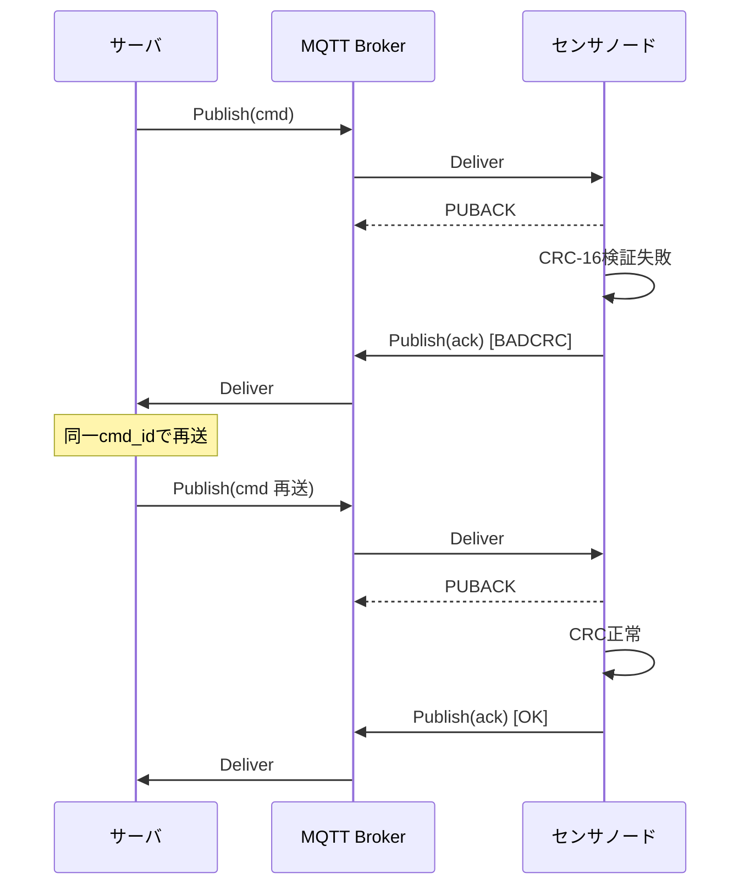
```mermaid
sequenceDiagram
    participant S as サーバ
    participant B as MQTT Broker
    participant D as センサノード

    S->>B: Publish(cmd)
    B->>D: Deliver
    D-->>B: PUBACK

    D->>D: CRC-16検証失敗

    D->>B: Publish(ack) [BADCRC]
    B->>S: Deliver

    Note over S: 同一cmd_idで再送

    S->>B: Publish(cmd 再送)
    B->>D: Deliver
    D-->>B: PUBACK

    D->>D: CRC正常
    D->>B: Publish(ack) [OK]
    B->>S: Deliver
```

- タイムアウト時の処理フロー
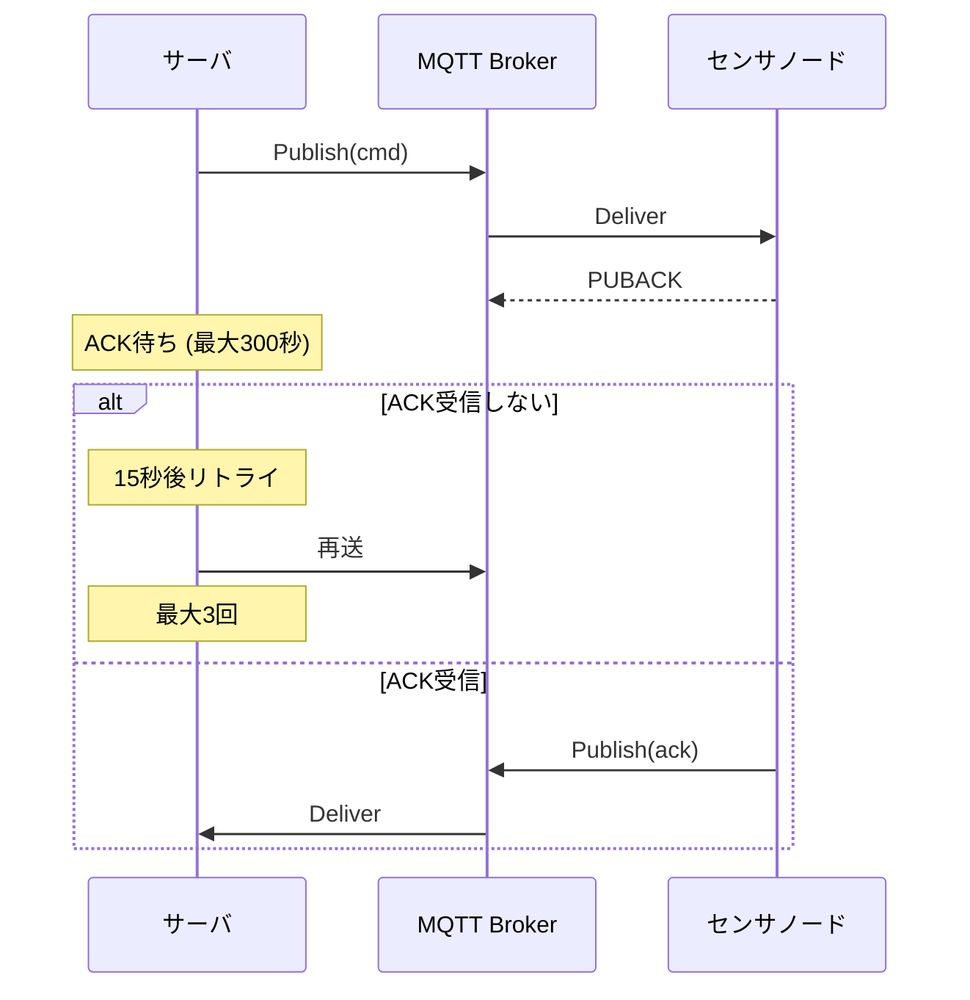
```mermaid
sequenceDiagram
    participant S as サーバ
    participant B as MQTT Broker
    participant D as センサノード

    S->>B: Publish(cmd)
    B->>D: Deliver
    D-->>B: PUBACK

    Note over S: ACK待ち (最大300秒)

    alt ACK受信しない
        Note over S: 15秒後リトライ
        S->>B: 再送
        Note over S: 最大3回
    else ACK受信
        D->>B: Publish(ack)
        B->>S: Deliver
    end
```

- 重複受信時の処理フロー
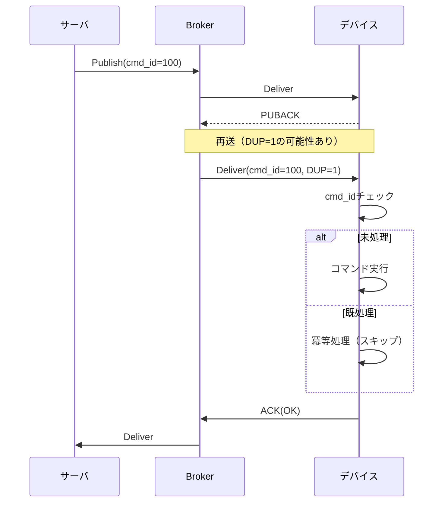
```mermaid
sequenceDiagram
    participant S as サーバ
    participant B as Broker
    participant D as デバイス

    S->>B: Publish(cmd_id=100)
    B->>D: Deliver
    D-->>B: PUBACK

    Note over B,D: 再送（DUP=1の可能性あり）

    B->>D: Deliver(cmd_id=100, DUP=1)

    D->>D: cmd_idチェック

    alt 未処理
        D->>D: コマンド実行
    else 既処理
        D->>D: 冪等処理（スキップ）
    end

    D->>B: ACK(OK)
    B->>S: Deliver
```

- 期限切れ(EXPIRED)の処理フロー
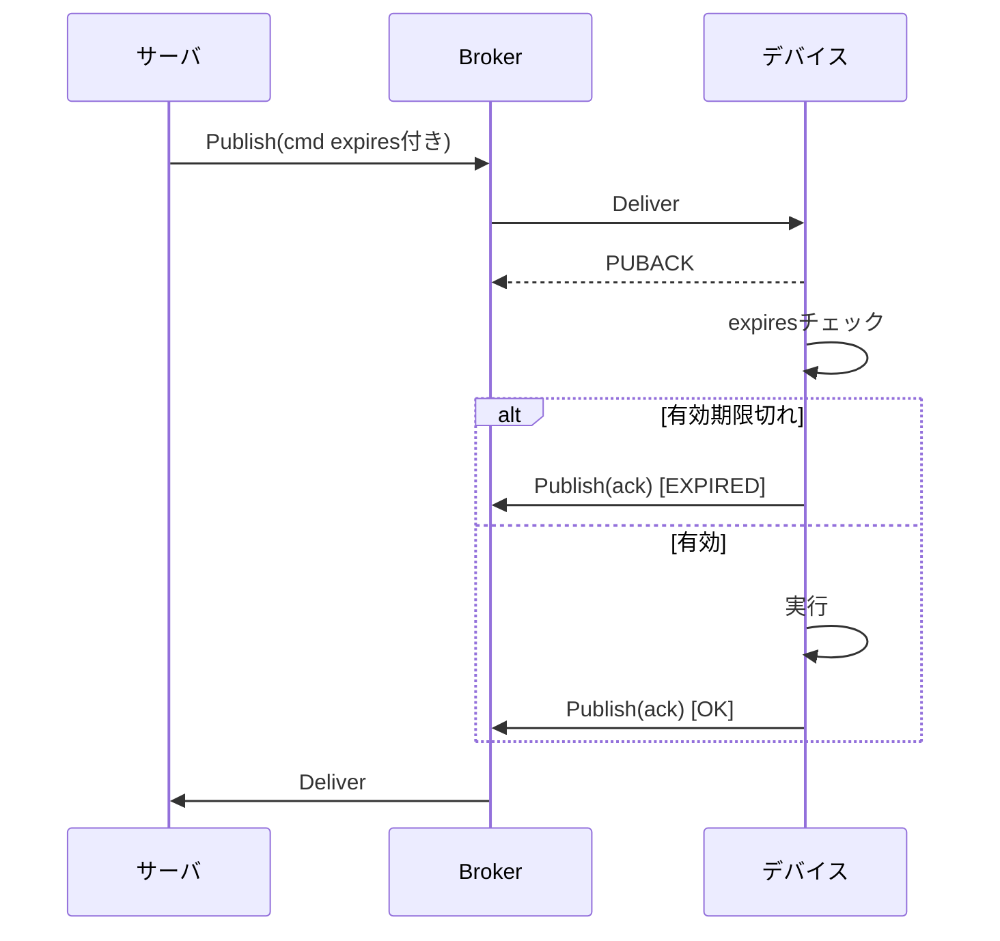
```mermaid
sequenceDiagram
    participant S as サーバ
    participant B as Broker
    participant D as デバイス

    S->>B: Publish(cmd expires付き)
    B->>D: Deliver
    D-->>B: PUBACK

    D->>D: expiresチェック

    alt 有効期限切れ
        D->>B: Publish(ack) [EXPIRED]
    else 有効
        D->>D: 実行
        D->>B: Publish(ack) [OK]
    end

    B->>S: Deliver
```

- BUSY時の処理フロー
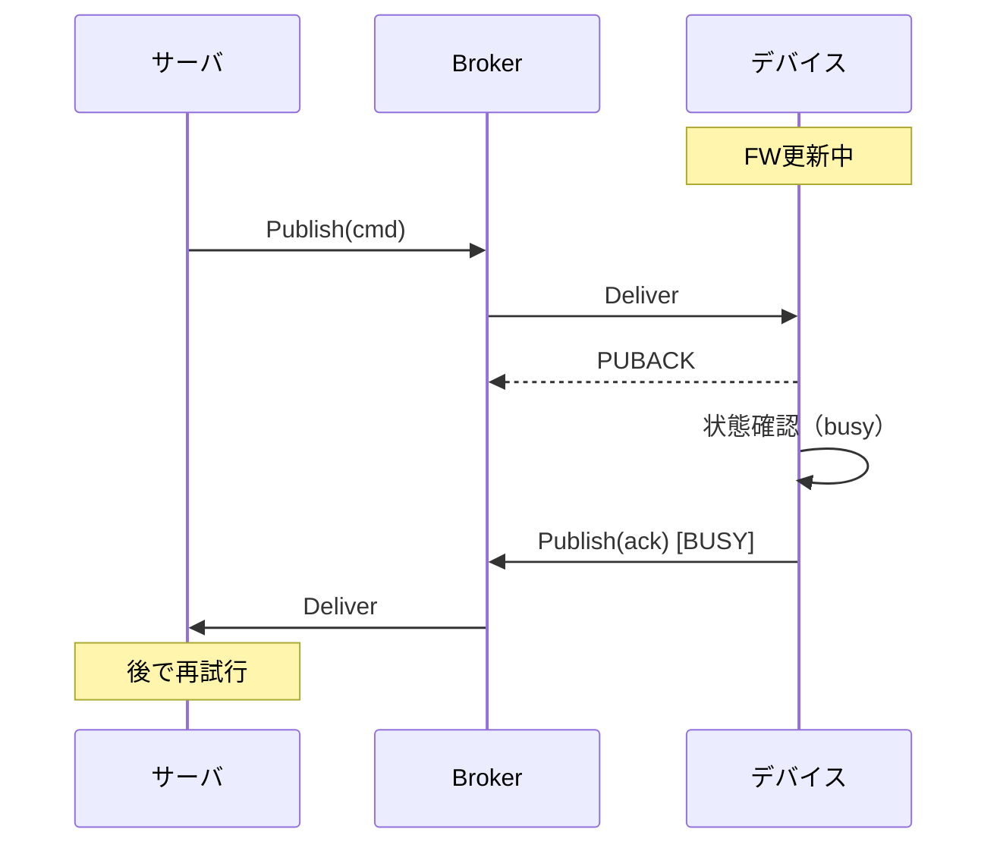
```mermaid
sequenceDiagram
    participant S as サーバ
    participant B as Broker
    participant D as デバイス

    Note over D: FW更新中

    S->>B: Publish(cmd)
    B->>D: Deliver
    D-->>B: PUBACK

    D->>D: 状態確認（busy）

    D->>B: Publish(ack) [BUSY]
    B->>S: Deliver

    Note over S: 後で再試行
```


## 通信フロー

### 通常コマンド実行フロー（SET_INTERVAL / SET_MODE / START_MEASURE / STOP_MEASURE）

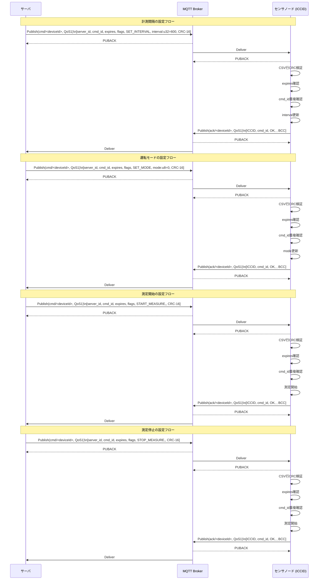
```mermaid
sequenceDiagram
    participant S as サーバ
    participant B as MQTT Broker
    participant D as センサノード (ICCID)

    Note over S,D: 計測間隔の設定フロー

    S->>B: Publish(cmd/<deviceId>, QoS1)\n[server_id, cmd_id, expires, flags, SET_INTERVAL, interval:u32=600, CRC-16]
    B-->>S: PUBACK
    B->>D: Deliver
    D-->>B: PUBACK

    D->>D: CSV行CRC検証
    D->>D: expires確認
    D->>D: cmd_id重複確認
    D->>D: interval更新

    D->>B: Publish(ack/<deviceId>, QoS1)\n[ICCID, cmd_id, OK, , BCC]
    B-->>D: PUBACK
    B->>S: Deliver
	
	Note over S,D: 運転モードの設定フロー
	
    S->>B: Publish(cmd/<deviceId>, QoS1)\n[server_id, cmd_id, expires, flags, SET_MODE, mode:u8=0, CRC-16]
    B-->>S: PUBACK
    B->>D: Deliver
    D-->>B: PUBACK

    D->>D: CSV行CRC検証
    D->>D: expires確認
    D->>D: cmd_id重複確認
    D->>D: mode更新

    D->>B: Publish(ack/<deviceId>, QoS1)\n[ICCID, cmd_id, OK, , BCC]
    B-->>D: PUBACK
    B->>S: Deliver
	
	Note over S,D: 測定開始の設定フロー
	
	S->>B: Publish(cmd/<deviceId>, QoS1)\n[server_id, cmd_id, expires, flags, START_MEASURE,, CRC-16]
    B-->>S: PUBACK
    B->>D: Deliver
    D-->>B: PUBACK

    D->>D: CSV行CRC検証
    D->>D: expires確認
    D->>D: cmd_id重複確認
    D->>D: 測定開始

    D->>B: Publish(ack/<deviceId>, QoS1)\n[ICCID, cmd_id, OK, , BCC]
    B-->>D: PUBACK
    B->>S: Deliver
	
	Note over S,D: 測定停止の設定フロー
	
	S->>B: Publish(cmd/<deviceId>, QoS1)\n[server_id, cmd_id, expires, flags, STOP_MEASURE,, CRC-16]
    B-->>S: PUBACK
    B->>D: Deliver
    D-->>B: PUBACK

    D->>D: CSV行CRC検証
    D->>D: expires確認
    D->>D: cmd_id重複確認
    D->>D: 測定開始

    D->>B: Publish(ack/<deviceId>, QoS1)\n[ICCID, cmd_id, OK, , BCC]
    B-->>D: PUBACK
    B->>S: Deliver
```

### GET_STATUS 実行フロー

1. `res`でFWのバージョン`fw`、計測間隔`interval`(秒)、動作モード`mode`、DIPスイッチの状態`dip`を返す
2. DIPスイッチが複数ある場合、スイッチの値を`/`で繋げる

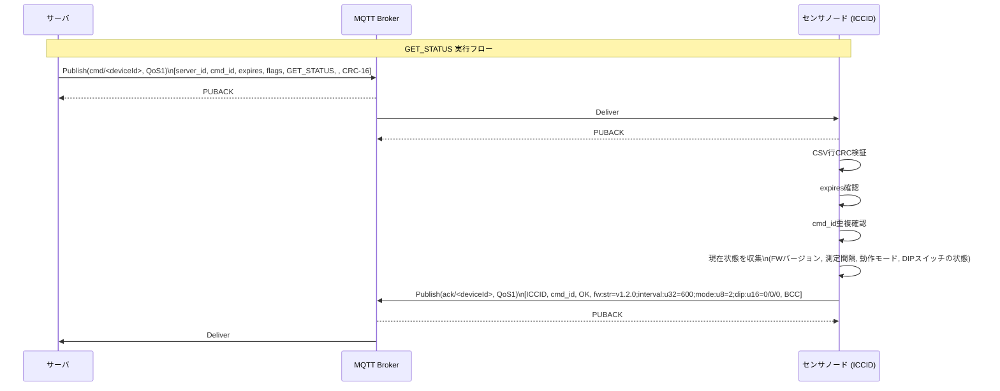
```mermaid
sequenceDiagram
    participant S as サーバ
    participant B as MQTT Broker
    participant D as センサノード (ICCID)

    Note over S,D: GET_STATUS 実行フロー

    S->>B: Publish(cmd/<deviceId>, QoS1)\n[server_id, cmd_id, expires, flags, GET_STATUS, , CRC-16]
    B-->>S: PUBACK
    B->>D: Deliver
    D-->>B: PUBACK

    D->>D: CSV行CRC検証
    D->>D: expires確認
    D->>D: cmd_id重複確認
    D->>D: 現在状態を収集\n(FWバージョン, 測定間隔, 動作モード, DIPスイッチの状態)

    D->>B: Publish(ack/<deviceId>, QoS1)\n[ICCID, cmd_id, OK, fw:str=v1.2.0#59;interval:u32=600#59;mode:u8=2#59;dip:u16=0/0/0, BCC]
    B-->>D: PUBACK
    B->>S: Deliver
```

> 例ではDIPスイッチが3個あり、それぞれOFFの状態である。スイッチのbitが`HIGH`の場合が`1`、`LOW`の場合が`0`である。

### 特殊計測モードの実行フロー

下記の動作を定義します。
1. **START_MEASURE_OP**: 特殊計測モード開始。テレメトリーは維持するが、他のコマンドは受付けない。
2. **GET_MEASURE_OP**: 特殊計測モードの実行状態を取得するコマンド。計測データの取得はこのコマンドを使用します。
3. **STOP_MEASURE_OP**: 特殊計測モードを停止。

また、下記の条件を定義します。
* 特殊計測の結果は、1セット分をRAMに保持します。
* GET_MEASURE_OPは現在状態および保持データを取得するために使用します。
* STOP_MEASURE_OPによる停止は正常停止とし、status=idleを返す。
* status=idleは未実行または停止状態を示す。
* 特殊計測実行中にSTART_MEASURE_OPを受信した場合はBUSYを返す。

#### 特殊計測モードの開始と完了フロー
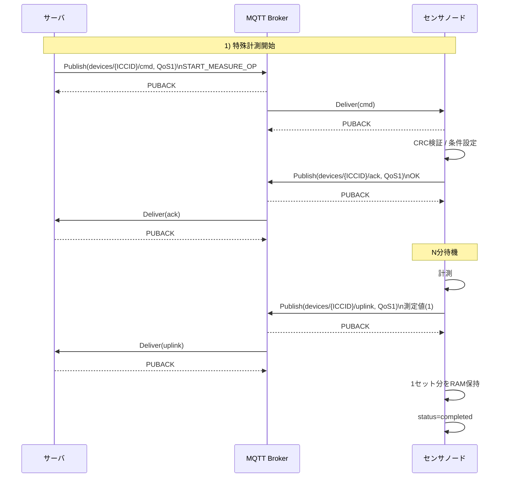
``` mermaid
sequenceDiagram
    participant S as サーバ
    participant B as MQTT Broker
    participant D as センサノード

    Note over S,D: 1) 特殊計測開始
    S->>B: Publish(devices/{ICCID}/cmd, QoS1)\nSTART_MEASURE_OP
    B-->>S: PUBACK
    B->>D: Deliver(cmd)
    D-->>B: PUBACK

    D->>D: CRC検証 / 条件設定
    D->>B: Publish(devices/{ICCID}/ack, QoS1)\nOK
    B-->>D: PUBACK
    B->>S: Deliver(ack)
    S-->>B: PUBACK

    Note over D: N分待機
    D->>D: 計測
    D->>B: Publish(devices/{ICCID}/uplink, QoS1)\n測定値(1)
    B-->>D: PUBACK
    B->>S: Deliver(uplink)
    S-->>B: PUBACK

    D->>D: 1セット分をRAM保持
    D->>D: status=completed
```

#### 特殊計測モードの状態取得
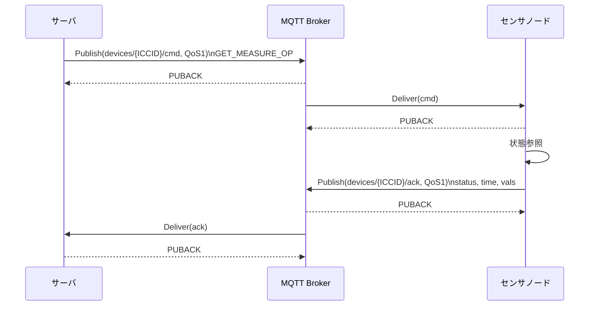
``` mermaid
sequenceDiagram
    participant S as サーバ
    participant B as MQTT Broker
    participant D as センサノード

    S->>B: Publish(devices/{ICCID}/cmd, QoS1)\nGET_MEASURE_OP
    B-->>S: PUBACK
    B->>D: Deliver(cmd)
    D-->>B: PUBACK

    D->>D: 状態参照
    D->>B: Publish(devices/{ICCID}/ack, QoS1)\nstatus, time, vals
    B-->>D: PUBACK
    B->>S: Deliver(ack)
    S-->>B: PUBACK
```

#### 途中停止フロー（OK + status=idle）
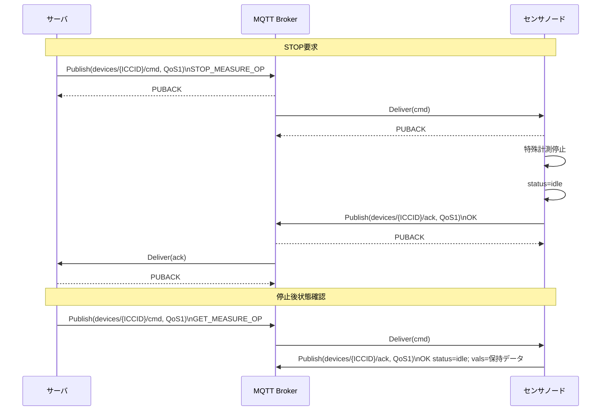
``` mermaid
sequenceDiagram
    participant S as サーバ
    participant B as MQTT Broker
    participant D as センサノード

    Note over S,D: STOP要求
    S->>B: Publish(devices/{ICCID}/cmd, QoS1)\nSTOP_MEASURE_OP
    B-->>S: PUBACK
    B->>D: Deliver(cmd)
    D-->>B: PUBACK

    D->>D: 特殊計測停止
    D->>D: status=idle

    D->>B: Publish(devices/{ICCID}/ack, QoS1)\nOK
    B-->>D: PUBACK
    B->>S: Deliver(ack)
    S-->>B: PUBACK

    Note over S,D: 停止後状態確認
    S->>B: Publish(devices/{ICCID}/cmd, QoS1)\nGET_MEASURE_OP
    B->>D: Deliver(cmd)
    D->>B: Publish(devices/{ICCID}/ack, QoS1)\nOK status=idle#59; vals=保持データ
```

#### 異常系(代表例)
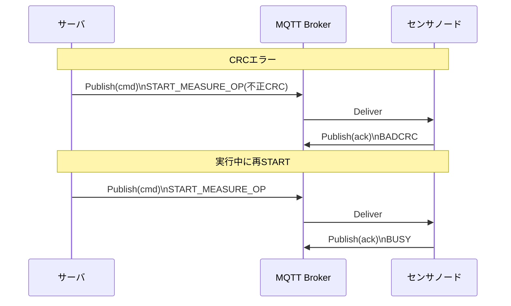
``` mermaid
sequenceDiagram
    participant S as サーバ
    participant B as MQTT Broker
    participant D as センサノード

    Note over S,D: CRCエラー
    S->>B: Publish(cmd)\nSTART_MEASURE_OP(不正CRC)
    B->>D: Deliver
    D->>B: Publish(ack)\nBADCRC

    Note over S,D: 実行中に再START
    S->>B: Publish(cmd)\nSTART_MEASURE_OP
    B->>D: Deliver
    D->>B: Publish(ack)\nBUSY
```

### FW断片配信（MQTT Chunking）仕様とフロー
1. **FW_BEGIN**: セッション開始。センサノードは記憶領域を確保。
2. **FW_CHUNK**: サーバーがデータを分割送信（**2048B単位/回**）。
3. **FW_END**: サーバーが送信完了を通知。センサノードが全体整合性を最終確認。

**フロー制御（Credit方式）**
センサノードはACKの `res` フィールドを通じて `credit`（現在追加で受領可能なチャンク数）を通知します。
サーバーは、通知された `credit` 数を超過して未承認のチャンクを送信してはならない。

**進捗ACKのres構成**
FW更新中の `res` フィールドは、以下のキーを**セミコロン（;）**で連結して記述します。
* 例: `credit:u8=1`

cmd_idはチャンク単位で一意であること。


**通信フロー **
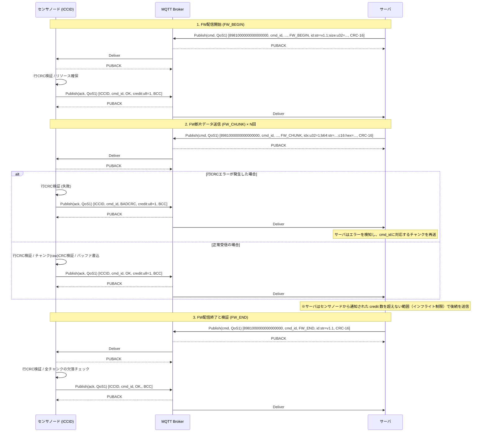
```mermaid
sequenceDiagram
    participant D as センサノード (ICCID)
    participant B as MQTT Broker
    participant S as サーバ

    Note over D,S: 1. FW配信開始 (FW_BEGIN)
    S->>B: Publish(cmd, QoS1) [8981000000000000000, cmd_id, ..., FW_BEGIN, id:str=v1.1#59;size:u32=..., CRC-16]
    B-->>S: PUBACK
    B->>D: Deliver
    D-->>B: PUBACK
    D->>D: 行CRC検証 / リソース確保
    D->>B: Publish(ack, QoS1) [ICCID, cmd_id, OK, credit:u8=1, BCC]
    B-->>D: PUBACK
    B->>S: Deliver

    Note over D,S: 2. FW断片データ送信 (FW_CHUNK) × N回
    S->>B: Publish(cmd, QoS1) [8981000000000000000, cmd_id, ..., FW_CHUNK, idx:u32=1#59;b64:str=...#59;c16:hex=..., CRC-16]
    B-->>S: PUBACK
    B->>D: Deliver
    D-->>B: PUBACK
    
    alt 行CRCエラーが発生した場合
        D->>D: 行CRC検証 (失敗)
        D->>B: Publish(ack, QoS1) [ICCID, cmd_id, BADCRC, credit:u8=1, BCC]
        B-->>D: PUBACK
        B->>S: Deliver
        Note over S: サーバはエラーを検知し、cmd_idに対応するチャンクを再送
    else 正常受信の場合
        D->>D: 行CRC検証 / チャンク(raw)CRC検証 / バッファ書込
        D->>B: Publish(ack, QoS1) [ICCID, cmd_id, OK, credit:u8=1, BCC]
        B-->>D: PUBACK
        B->>S: Deliver
    end

    Note over S: ※サーバはセンサノードから通知された credit 数を超えない範囲（インフライト制限）で後続を送信

    Note over D,S: 3. FW配信終了と検証 (FW_END)
    S->>B: Publish(cmd, QoS1) [8981000000000000000, cmd_id, FW_END, id:str=v1.1, CRC-16]
    B-->>S: PUBACK
    B->>D: Deliver
    D-->>B: PUBACK
    D->>D: 行CRC検証 / 全チャンクの欠落チェック

    D->>B: Publish(ack, QoS1) [ICCID, cmd_id, OK,, BCC]
    B-->>D: PUBACK
    B->>S: Deliver
```

### 全体フロー

1. 通常時の全体フロー（正常系）
定期的なテレメトリ送信が行われている状態で、サーバーから各種コマンド（`SET_INTERVAL`、`SET_MODE`、`GET_STATUS`、`START_MEASURE`、`STOP_MEASURE`）が発行され、正常に処理されるまでの基本フローです。

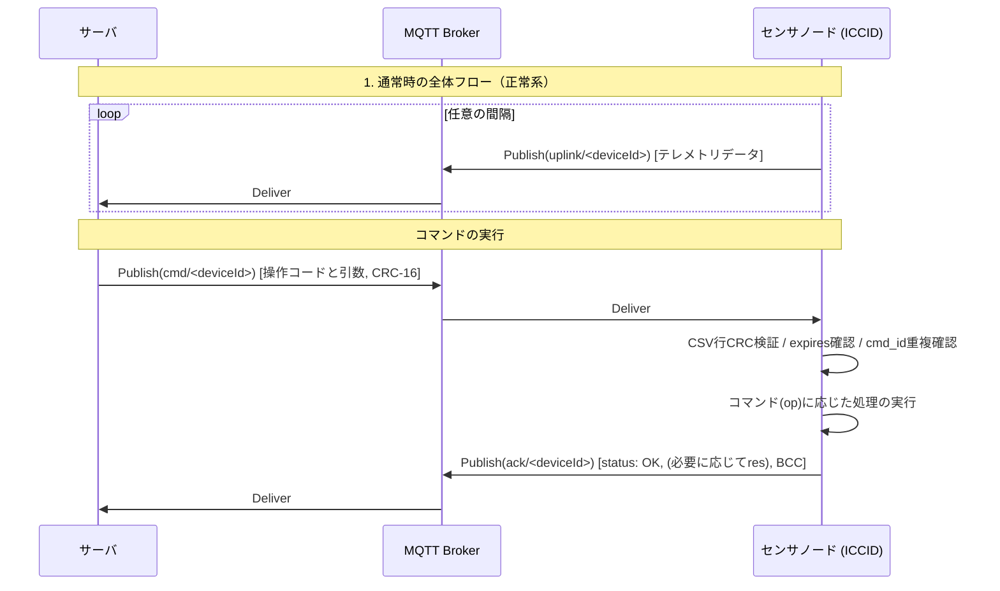
```mermaid
sequenceDiagram
    participant S as サーバ
    participant B as MQTT Broker
    participant D as センサノード (ICCID)

    Note over S,D: 1. 通常時の全体フロー（正常系）
    
    loop 任意の間隔
        D->>B: Publish(uplink/<deviceId>) [テレメトリデータ]
        B->>S: Deliver
    end

    Note over S,D: コマンドの実行
    S->>B: Publish(cmd/<deviceId>) [操作コードと引数, CRC-16]
    B->>D: Deliver
    
    D->>D: CSV行CRC検証 / expires確認 / cmd_id重複確認
    D->>D: コマンド(op)に応じた処理の実行
    
    D->>B: Publish(ack/<deviceId>) [status: OK, (必要に応じてres), BCC]
    B->>S: Deliver
```

2. ファームウェア(FW)アップデートの全体フロー
FW_BEGINによるセッション開始から、`FW_CHUNK`による2048B単位での断片データ送信、そして`FW_END`による完了通知と最終確認までの一連のOTA（Over-The-Air）フローです。
デバイスから通知されるcredit数を超えないようにフロー制御を行います。

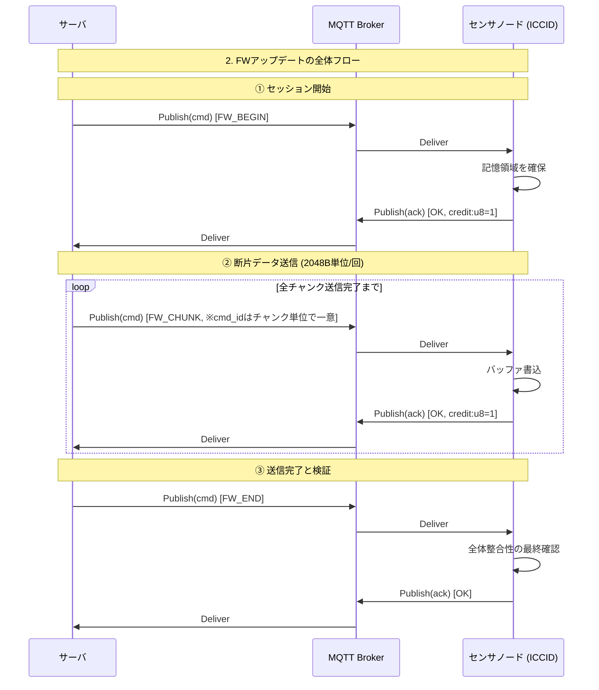
```mermaid
sequenceDiagram
    participant S as サーバ
    participant B as MQTT Broker
    participant D as センサノード (ICCID)

    Note over S,D: 2. FWアップデートの全体フロー
    
    Note over S,D: ① セッション開始
    S->>B: Publish(cmd) [FW_BEGIN]
    B->>D: Deliver
    D->>D: 記憶領域を確保
    D->>B: Publish(ack) [OK, credit:u8=1]
    B->>S: Deliver

    Note over S,D: ② 断片データ送信 (2048B単位/回)
    loop 全チャンク送信完了まで
        S->>B: Publish(cmd) [FW_CHUNK, ※cmd_idはチャンク単位で一意]
        B->>D: Deliver
        D->>D: バッファ書込
        D->>B: Publish(ack) [OK, credit:u8=1]
        B->>S: Deliver
    end

    Note over S,D: ③ 送信完了と検証
    S->>B: Publish(cmd) [FW_END]
    B->>D: Deliver
    D->>D: 全体整合性の最終確認
    D->>B: Publish(ack) [OK]
    B->>S: Deliver
```

3. 例外発生時の全体フロー（異常系：再送と中断）
コマンド発行時に何らかの異常（CRCエラーによる`BADCRC`、期限切れによる`EXPIRED`、重複受信、または300秒のタイムアウト）が発生した場合のフローです。サーバーは最大3回のリトライを行い、それでも失敗した場合はコマンドを破棄して計測処理へ戻ります。
※ただし、`BUSY`を受信した場合はこの再送ループには入らず、直ちにコマンドを破棄して計測を継続します。

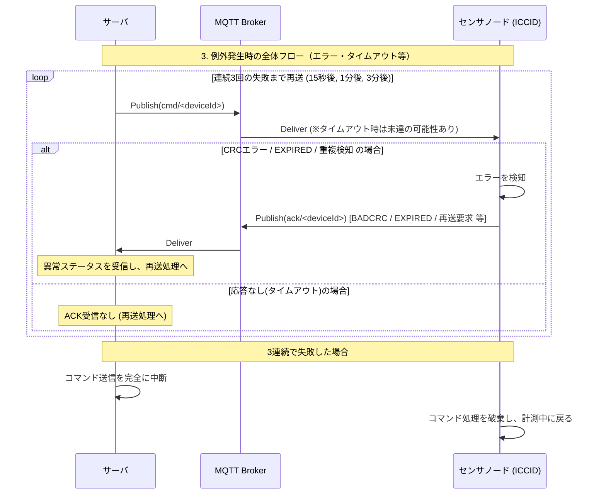
```mermaid
sequenceDiagram
    participant S as サーバ
    participant B as MQTT Broker
    participant D as センサノード (ICCID)

    Note over S,D: 3. 例外発生時の全体フロー（エラー・タイムアウト等）
    
    loop 連続3回の失敗まで再送 (15秒後, 1分後, 3分後)
        S->>B: Publish(cmd/<deviceId>)
        B->>D: Deliver (※タイムアウト時は未達の可能性あり)

        alt CRCエラー / EXPIRED / 重複検知 の場合
            D->>D: エラーを検知
            D->>B: Publish(ack/<deviceId>) [BADCRC / EXPIRED / 再送要求 等]
            B->>S: Deliver
            Note over S: 異常ステータスを受信し、再送処理へ
        else 応答なし(タイムアウト)の場合
            Note over S: ACK受信なし (再送処理へ)
        end
    end

    Note over S,D: 3連続で失敗した場合
    S->>S: コマンド送信を完全に中断
    D->>D: コマンド処理を破棄し、計測中に戻る
```


## 通信電文例

以下の例文末尾にある [CRC-16] は大文字4桁、[BCC] は大文字2桁の16進数が入る。
これらのチェックサムは、直前の最後のカンマ(`,`)までを含めた文字列全体を対象に計算された値となる。

### コマンド電文

* 下りコマンド: サーバー特殊ID（8981000000000000000）を先頭にし、末尾には**CRC-16（4桁）を付与します。フィールドで複数の値を指定する場合はセミコロン（;）**で区切る。
* 応答: resフィールドへのデータ格納は`GET_STATUS`、`FW_CHUNK`、`GET_MEASURE_OP`応答時のみ行う。

#### SET_INTERVAL（計測・送信間隔の設定）
計測・送信間隔の設定を変更する場合に使用するコマンドである。

1. サーバ -> センサノード
```csv
8981000000000000000,2001,202602281300,1,SET_INTERVAL,interval:u32=600,[CRC-16]
```

2. センサノード -> サーバ 
- 正常終了ACK
```csv
8981123456789012345,2001,OK,,[BCC]
```

- エラーACK
```csv
8981123456789012345,2001,BADCRC,,[BCC]
```

> `BADCRC`以外では、`EXPIRED`、`BUSY`、`NG`があります。
> 有効期限切れの場合は`EXPIRED`、FW更新処理中は`BUSY`、その他のエラーの場合(センサノードで処理できなかった場合)は`NG`を返します。

####  SET_MODE（動作モードの変更）
動作モードの設定を変更する場合に使用するコマンドである。

1. サーバ -> センサノード
```csv
8981000000000000000,2002,202602281300,1,SET_MODE,mode:u8=2,[CRC-16]
```

2. センサノード -> サーバ 
- 正常応答
```csv
8981123456789012345,2002,OK,,[BCC]
```

- エラー応答
```csv
8981123456789012345,2002,BADCRC,,[BCC]
```

> `BADCRC`以外では、`EXPIRED`、`BUSY`、`NG`があります。
> 有効期限切れの場合は`EXPIRED`、FW更新処理中は`BUSY`、その他のエラーの場合(センサノードで処理できなかった場合)は`NG`を返します。

#### GET_STATUS（現在のセンサノード状態の取得）
センサノードのファームウェアバージョン、DIPスイッチの状態、計測・送信間隔、動作モードを取得する場合に使用するコマンドである。

1. サーバ -> センサノード
```csv
8981000000000000000,2003,202602281300,1,GET_STATUS,,[CRC-16]
```

2. センサノード -> サーバ
- 正常応答
```csv
8981123456789012345,2003,OK,fw:str=v1.2.0;dip:u8=1/0/12;interval:u32=600;mode:u8=2,[BCC]
```

> **fw**: FWのバージョン
> **dip**: DIPスイッチの状態
> **interval**: 計測・送信間隔(秒)
> **mode**: 動作モード

* 『特記事項』:複数のDIPスイッチが搭載されている場合、各スイッチの取得値はスラッシュ（/）で区切って連結して出力します（例：3つのスイッチが全て0の場合は 0/0/0 となります）。

- エラー応答
```csv
8981123456789012345,2003,BADCRC,,[BCC]
```

> `BADCRC`以外では、`EXPIRED`、`BUSY`、`NG`がある。
> 有効期限切れの場合は`EXPIRED`、FW更新処理中は`BUSY`、その他のエラーの場合(センサノードで処理できなかった場合)は`NG`を返す。

#### FW_BEGIN（FW更新セッション開始）
1. サーバ -> センサノード
```csv
8981000000000000000,2004,202602281300,1,FW_BEGIN,id:str=v1.1;size:u32=102400;div:u8=8,[CRC-16]
```

> **id**: 動作中のFWバージョン
> **size**: FWのサイズ(バイト)
> **div**: FWの分割数(N)

2. センサノード -> サーバ
- 正常応答
```csv
8981123456789012345,2004,OK,credit:u8=1,[BCC]
```

> `credit`は常に`1`を設定します。

- エラー応答
```csv
8981123456789012345,2004,BADCRC,,[BCC]
```

> `BADCRC`以外では、`EXPIRED`、`NG`があります。
> 有効期限切れの場合は`EXPIRED`、その他のエラーの場合(センサノードで処理できなかった場合)は`NG`を返します。

#### FW_CHUNK（FW断片データ送信：2,048B単位）
```csv
8981000000000000000,2005,202602281300,1,FW_CHUNK,idx:u32=1;b64:str=YWJj...;c16:hex=A1B2,[CRC-16]
```

2. センサノード -> サーバ
- 正常応答
```csv
8981123456789012345,2005,OK,credit:u8=1,[BCC]
```

> `credit`は常に`1`を設定します。

- エラー応答
```csv
8981123456789012345,2005,BADCRC,,[BCC]
```

> `BADCRC`以外では、`EXPIRED`、`NG`があります。
> 有効期限切れの場合は`EXPIRED`、その他のエラーの場合(センサノードで処理できなかった場合)は`NG`を返します。

#### FW_END（FW配信終了と検証）
1. サーバ -> センサノード
```csv
8981000000000000000,2006,202602281300,1,FW_END,id:str=v1.1,[CRC-16]
```

2. センサノード -> サーバ
- 正常応答
```csv
8981123456789012345,2006,OK,,[BCC]
```

- エラー応答
```csv
8981123456789012345,2006,BADCRC,,[BCC]
```

> `BADCRC`以外では、`EXPIRED`、`NG`があります。
> 有効期限切れの場合は`EXPIRED`、その他のエラーの場合(センサノードで処理できなかった場合)は`NG`を返します。

#### START_MEASURE（計測開始）
計測・送信を開始する場合に使用します。

1. サーバ -> センサノード
```csv
8981000000000000000,2007,202602281300,1,START_MEASURE,,[CRC-16]
```

2. センサノード -> サーバ
- 正常応答
```csv
8981123456789012345,2007,OK,,[BCC]
```

- エラー応答
```csv
8981123456789012345,2007,BADCRC,,[BCC]
```

> `BADCRC`以外では、`EXPIRED`、`BUSY`、`NG`があります。
> 有効期限切れの場合は`EXPIRED`、FW更新処理中は`BUSY`、その他のエラーの場合(センサノードで処理できなかった場合)は`NG`を返します。

#### STOP_MEASURE（計測停止）
計測・送信を停止する場合に使用します。

1. サーバ -> センサノード
```csv
8981000000000000000,2008,202602281300,1,STOP_MEASURE,,[CRC-16]
```

2. センサノード -> サーバ
- 正常応答
```csv
8981123456789012345,2008,OK,,[BCC]
```

- エラー応答
```csv
8981123456789012345,2008,BADCRC,,[BCC]
```

> `BADCRC`以外では、`EXPIRED`、`BUSY`、`NG`があります。
> 有効期限切れの場合は`EXPIRED`、FW更新処理中は`BUSY`、その他のエラーの場合(センサノードで処理できなかった場合)は`NG`を返します。

#### START_MEASURE_OP（特殊計測開始）
特殊な計測モードを開始する場合に使用します。

1. サーバ -> センサノード
```csv
8981000000000000000,2009,202602281300,1,START_MEASURE_OP,,[CRC-16]
```

2. センサノード -> サーバ
- 正常応答
```csv
8981123456789012345,2009,OK,,[BCC]
```

- エラー応答
```csv
8981123456789012345,2009,BADCRC,,[BCC]
```

> `BADCRC`以外では、`EXPIRED`、`BUSY`、`NG`があります。
> 有効期限切れの場合は`EXPIRED`、FW更新処理中は`BUSY`、その他のエラーの場合(センサノードで処理できなかった場合)は`NG`を返します。

#### STOP_MEASURE_OP（特殊計測停止）
計測・送信を停止する場合に使用します。

1. サーバ -> センサノード
```csv
8981000000000000000,2010,202602281300,1,STOP_MEASURE_OP,,[CRC-16]
```

2. センサノード -> サーバ
- 正常応答
```csv
8981123456789012345,2010,OK,,[BCC]
```

- エラー応答
```csv
8981123456789012345,2010,BADCRC,,[BCC]
```

> `BADCRC`以外では、`EXPIRED`、`BUSY`、`NG`があります。
> 有効期限切れの場合は`EXPIRED`、FW更新処理中は`BUSY`、その他のエラーの場合(センサノードで処理できなかった場合)は`NG`を返します。

#### GET_MEASURE_OP（特殊計測の状態取得）
特殊計測中の状態を取得する場合に使用します。

1. サーバ -> センサノード
```csv
8981000000000000000,2011,202602281255,1,GET_MEASURE_OP,,[CRC-16]
```

2. センサノード -> サーバ
- 正常応答(計測前)
```csv
8981123456789012345,2011,OK,status:str=in_progress;time:str=;vals:f32=,[BCC]
```

- 正常応答(計測後)
```csv
8981123456789012345,2011,OK,status:str=completed;time:str=202602281315;vals:f32=12.34,[BCC]
```

**status**: 処理状態(idle:未処理 / in_progress:処理中 / completed:完了 / failed:失敗)
**time**: 最後に成功した計測日時(YYYYMMDDHHmm)
**vals**: 取得済みの測定値を出力します。未取得の場合は空とします。

> 計測終了後、1セット(例では3回計測が1セット)の分のデータはRAMで保持します。

- エラー応答(通常)
```csv
8981123456789012345,2011,BADCRC,,[BCC]
```

> `BADCRC`以外では、`EXPIRED`、`BUSY`、`NG`がある。
> 有効期限切れの場合は`EXPIRED`、処理中は`BUSY`、その他のエラーの場合(センサノードで処理できなかった場合)は`NG`を返す。

- エラー応答(計測失敗)
```csv
8981123456789012345,2011,NG,status:str=failed;time:str=;vals:f32=,[BCC]
```

> 応答コードに NG を設定し、status=failed、その他の項目は空または取得済み値なしで返す。
> 異常発生時は処理を停止する(リトライはしない)。

## Web API コマンド制御仕様書：JSON通信定義
API経由でセンサノードにコマンドを送信するインターフェイスを定義します。

### 認証仕様
Web APIのすべてのアクションにおいて、Zabbixで発行された認証キーを使用した認証を必須とします。API呼び出し時は、HTTPリクエストヘッダ等に当該認証キーを含めて送信する必要がある。

### データ構造と対応コマンド
データはJSON形式とします。

| No | 項目名  | 型      | 説明                                                      |
|----|---------|---------|-----------------------------------------------------------|
| 1  | ICCID   | str     | 配信先センサノードのICCID                                 |
| 2  | cmd_id  | u32     | コマンド一連番号                                          |
| 3  | expires | str(12) | 有効期限（12桁JSTタイムスタンプ）                         |
| 4  | flags   | u8      | 制御フラグ (ACK要求=1, ACK不要=0)                         |
| 5  | op      | str     | 操作コード                                                |
| 6  | arg     | str     | 引数 (key:type=value 形式、複数時はセミコロン（;）区切り) |

Web API経由でのコマンド発行および実行結果取得のJSONリクエスト・レスポンス例を提示します。 これまでの仕様定義に基づき、 Web APIの対応コマンドは`SET_INTERVAL`、`SET_MODE`、`GET_STATUS`、 START_MEASURE、STOP_MEASUREに限定され、ファームウェアアップデート関連のコマンド（ FW_BEGIN など）はAPIからは対応していません。
また、すべてのリクエストには、 HTTPヘッダ等にZabbixで発行された認証キーを含めることが必須 となります。

### 応答処理について
コマンド発行時の応答はHTTPのステータスコードで返す。

| No. | コード | 内容                                         |
|-----|--------|----------------------------------------------|
| 1   | 200    | コマンドを受理                               |
| 2   | 400    | コマンドにエラーがある場合                   |
| 3   | 401    | 認証エラー（Zabbix認証キーの不正・未設定等） |
| 4   | 500    | サーバ側で処理に失敗した場合                 |


## Web API コマンド通信例

### コマンド発行（エンドポイント: https://xxxxx.com/cmd/）
JSON形式で送信し、argフィールドで複数の値を指定する場合は、MQTT通信側の仕様と同様に セミコロン（ ; ）で区切ります。

- SET_INTERVAL（計測・送信間隔の設定）
```json
{
  "ICCID": "8981123456789012345",
  "cmd_id": 2001,
  "expires": "202602281300",
  "flags": 1,
  "op": "SET_INTERVAL",
  "arg": "interval:u32=600"
}
```

- SET_MODE（動作モードの変更）
```json
{
  "ICCID": "8981123456789012345",
  "cmd_id": 2002,
  "expires": "202602281300",
  "flags": 1,
  "op": "SET_MODE",
  "arg": "mode:u8=2"
}
```

- GET_STATUS（現在のセンサノード状態の取得） 引数がないため、argは空文字を指定します。
```json
{
  "ICCID": "8981123456789012345",
  "cmd_id": 2003,
  "expires": "202602281300",
  "flags": 1,
  "op": "GET_STATUS",
  "arg": ""
}
```

- START_MEASURE（計測開始） 引数がないため、argは空文字を指定します。
```json
{
  "ICCID": "8981123456789012345",
  "cmd_id": 2007,
  "expires": "202602281300",
  "flags": 1,
  "op": "START_MEASURE",
  "arg": ""
}
```

- STOP_MEASURE（計測停止） 引数がないため、argは空文字を指定します。
```json
{
  "ICCID": "8981123456789012345",
  "cmd_id": 2008,
  "expires": "202602281300",
  "flags": 1,
  "op": "STOP_MEASURE",
  "arg": ""
}
```

`START_MEASURE_OP`、`STOP_MEASURE_OP`は他のコマンドと同様です。

### コマンド実行結果の取得
サーバー側で7日間一時ストアされている、センサノードからの応答（ACK）を取得します。
要求JSON例 結果を取得したいセサノードのICCIDと、発行時のcmd_idを指定します。
** エンドポイント: https://xxxx.com/ack **

```json
{
  "ICCID": "8981123456789012345",
  "cmd_id": 2003
}
```

応答JSON例（GET_STATUS成功時の例） GET_STATUS の応答では、 res に現在の設定状態がセミコロン区切りで格納されています。 (※ SET_INTERVAL や SET_MODE など、
センサノード側で res が空となるコマンドの応答の場合、取得用APIのレスポンスでも res は空として返却されます)

```json
{ // GET_STATUSの例
  "ICCID": "8981123456789012345",
  "cmd_id": 2003,
  "status": "OK",
  "res": "fw:str=v1.2.0;dip:u8=1;interval:u32=600;mode:u8=2"
}
```
